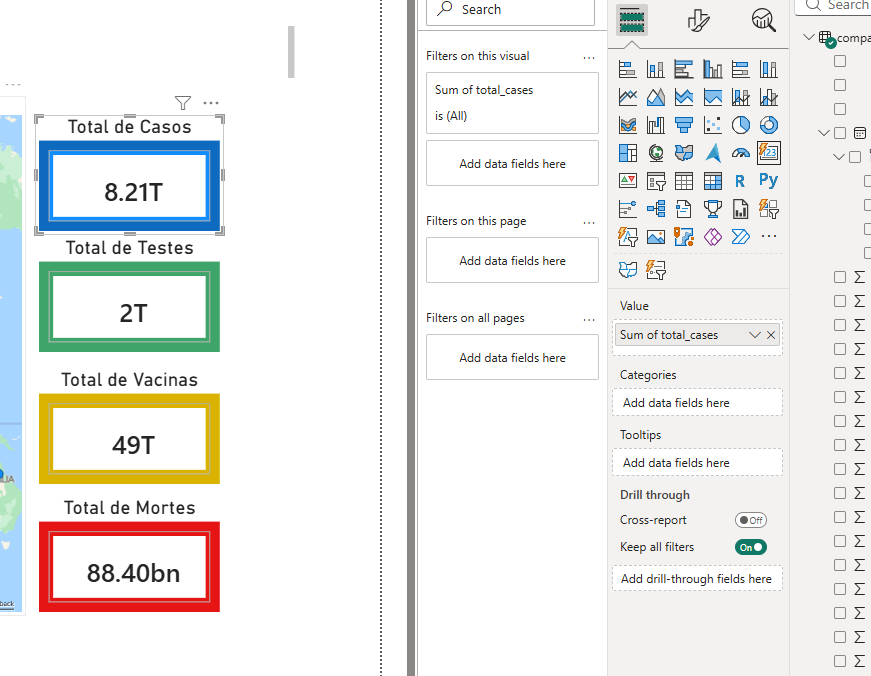
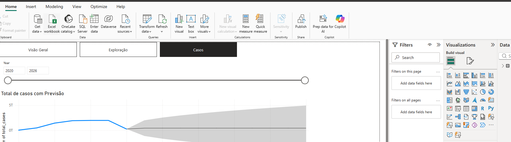

# 📊 COVID-19 Power BI Dashboard



## 🔗 Dataset
[Our World in Data COVID Dataset](https://catalog.ourworldindata.org/garden/covid/latest/compact/compact.csv)

---

## 🚀 Overview
This project builds an interactive Power BI dashboard to analyze COVID-19 trends, including cases, deaths, and vaccinations.

---

## 📥 1. Load Data
- **Get Data → Web/CSV**
- Load dataset
- Click **Transform Data**

---

## 🔧 2. Data Transformation

### ✔️ Use First Row as Headers
- Transform → *Use First Row as Headers*

### ✔️ Remove Columns
- Remove `human_development_index` (no data)

---

## 🔢 3. Data Types

### 🔹 Decimal Columns
Converted multiple columns such as:
- new_cases_smoothed
- total_cases_per_million
- reproduction_rate
- gdp_per_capita
- etc.

### 🔹 Whole Number Columns
- total_cases
- total_deaths
- population
- etc.

### 🔹 Date Column
- `date` → Date format

---

## 📊 4. Visualizations

### 📌 KPI Cards


**Steps:**
- Insert → Card
- Add measures (Total Cases, Deaths, etc.)
- Format currency and units

---

### 📈 Line Chart + Forecast


**Steps:**
- Axis → Date
- Values → Total Cases
- Analytics → Enable Forecast

---

### 🌳 Tree Map


**Steps:**
- Group → Location
- Values → Total Cases

---

### 🍩 Donut Chart


**Steps:**
- Legend → Category
- Values → Total Cases

---

### 🎚️ Slicer


**Steps:**
- Add slicer
- Use Date or Location
- Set to Between or List

---

## 🔍 Features
- Interactive filters
- Drill-down analysis
- Forecasting
- KPI monitoring

---

## 📦 Project Structure
```
/README.md
/images/
```

---

## 🎯 Conclusion
This dashboard enables dynamic exploration of COVID-19 data, supporting better insights and decision-making.

