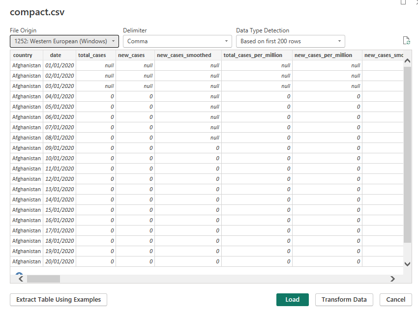
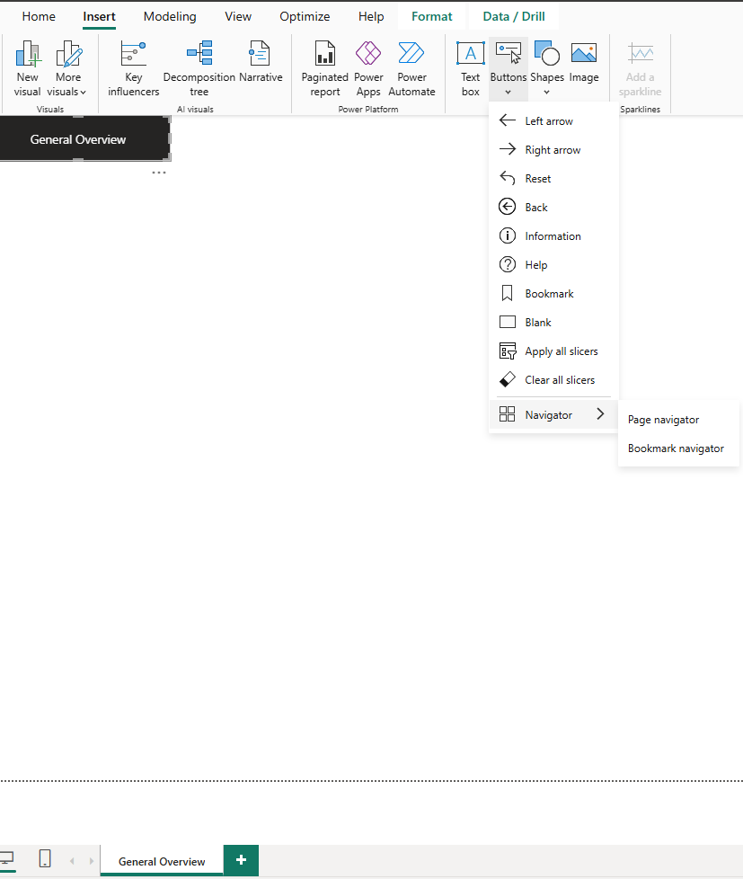
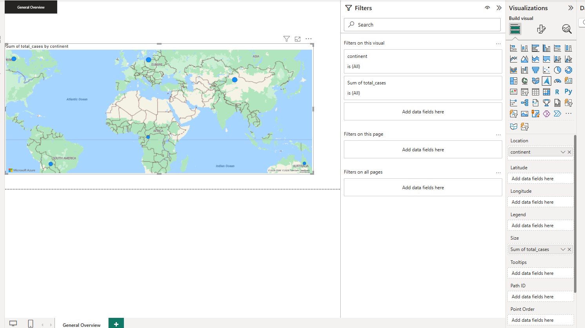
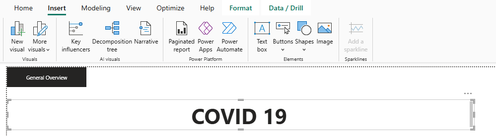
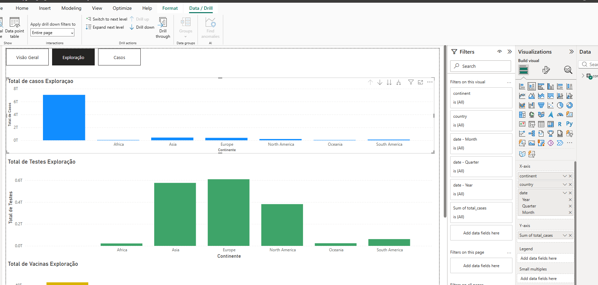
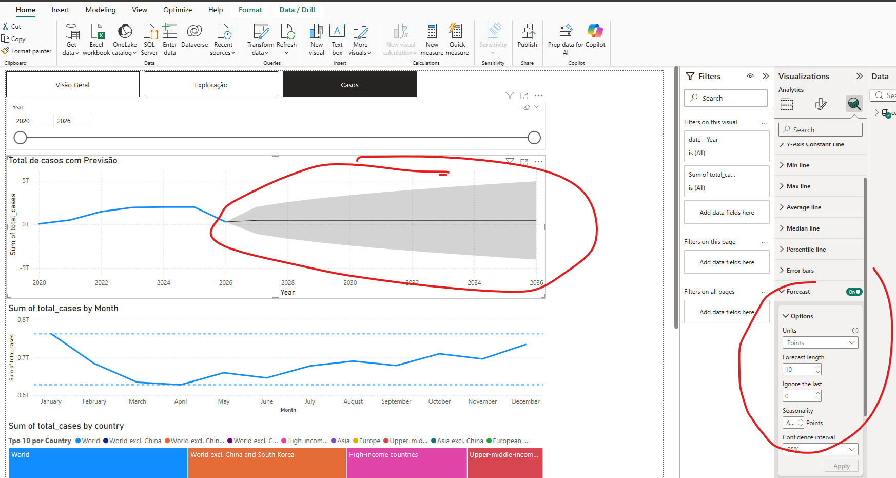
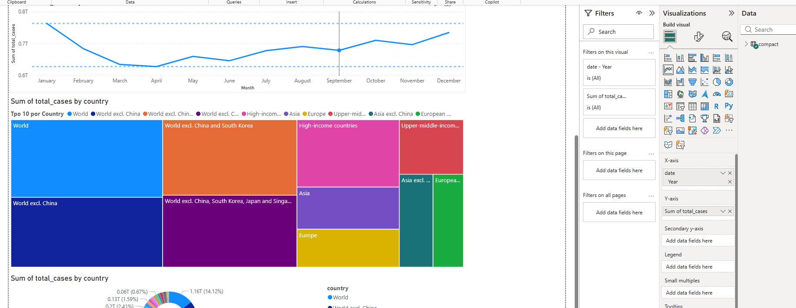
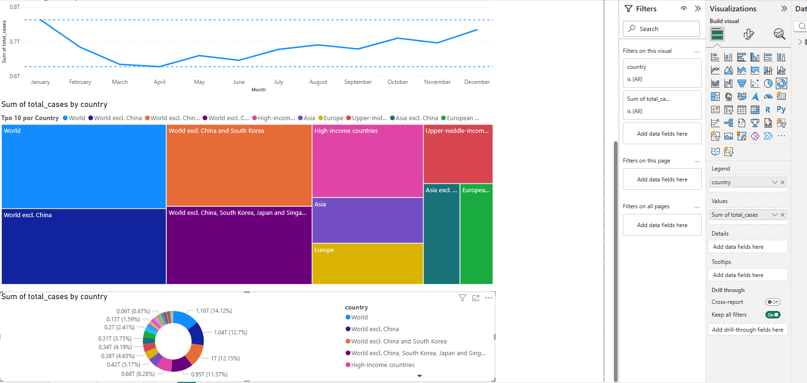

# 📊 COVID Power BI Report

---

## Carregar dataset

Link: https://catalog.ourworldindata.org/garden/covid/latest/compact/compact.csv

---

## Load and transform

---

## Remover coluna:

human_development_index não tem dados

---

## Transform: Use First Row as Headers

---

## Alterar Tipo de dados para os campos:

### Decimal

new_cases_smoothed  
total_cases_per_million  
new_cases_per_million  
new_cases_smoothed_per_million  
new_deaths_smoothed  
total_deaths_per_million  
new_deaths_per_million  
new_deaths_smoothed_per_million  
excess_mortality  
excess_mortality_cumulative  
excess_mortality_cumulative_absolute  
excess_mortality_cumulative_per_million  
hosp_patients_per_million  
weekly_hosp_admissions_per_million  
icu_patients_per_million  
weekly_icu_admissions_per_million  
stringency_index  
reproduction_rate  
total_tests_per_thousand  
new_tests_per_thousand  
new_tests_smoothed_per_thousand  
positive_rate  
tests_per_case  
new_vaccinations_smoothed  
total_vaccinations_per_hundred  
people_vaccinated_per_hundred  
people_fully_vaccinated_per_hundred  
total_boosters_per_hundred  
new_vaccinations_smoothed_per_million  
new_people_vaccinated_smoothed  
new_people_vaccinated_smoothed_per_hundred  
population_density  
median_age  
life_expectancy  
gdp_per_capita  
extreme_poverty  
diabetes_prevalence  
handwashing_facilities  
hospital_beds_per_thousand  

---

### WholeNumber

total_cases  
new_cases  
total_deaths  
new_deaths  
hosp_patients  
weekly_hosp_admissions  
icu_patients  
weekly_icu_admissions  
total_tests  
new_tests  
new_tests_smoothed  
total_vaccinations  
people_vaccinated  
people_fully_vaccinated  
total_boosters  
new_vaccinations  
population  

---

### Date

date  

---

## Criar Botões de Navegação

---

## Criar Mapa

---

## Criar titulo com caixa de Texto

---

## Criar Cards

---

## Criar Gráfico de barras com Data Drill

---

## Criar Linechart com previsão

---

## Criação de tree map

---

## Criar Donut Chart

---

## Criar Slicer

---
